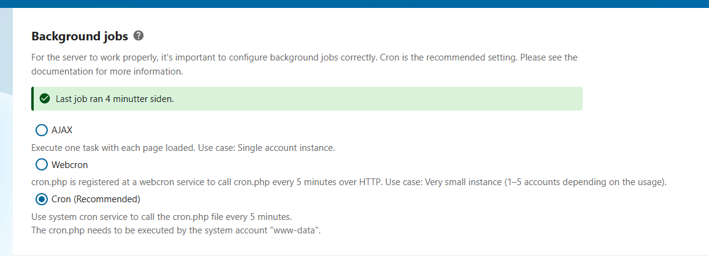
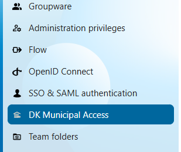
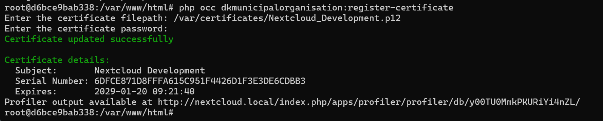
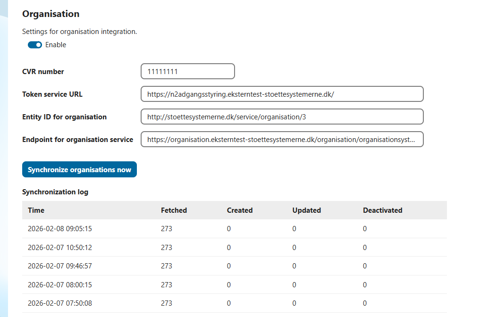
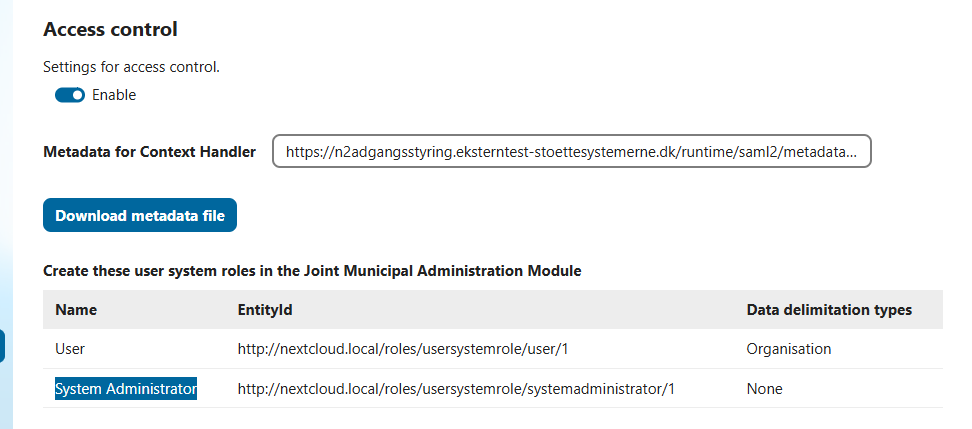

# Danish Municipal Organisation and Access Control

In Denmark, the organisation **KOMBIT** provides shared service integrations for public municipalities.

This app integrates Nextcloud with two core municipal services:

- **Organisation structure**
- **Access control via SAML login flow**

To use this app, you must follow the **Connection Guide** for both *Usable Systems* and *User-facing Systems*, available here:  
[Connection Guide](https://digitaliseringskataloget.dk/tilslutningsguide)

---

## Requirements

This app requires the **Team Folders** app to be installed:

- https://apps.nextcloud.com/apps/groupfolders

The organisation structure integration automatically creates a **team folder for each department**, allowing users to collaborate on documents.

Additionally, your Nextcloud instance **must be configured to run background jobs using cron**.



---

## Configuration

### System Certificate

The integrations require an **official system certificate** (`.p12` file) issued by the Danish government.

Steps:
1. Acquire the certificate via the **MitID Business** portal:  
   https://mitid-erhverv.dk/
2. Copy the certificate file to the Nextcloud server
3. Register the certificate in Nextcloud (see instructions below)

---

### Register IT System at Serviceplatformen

To use the integration, your Nextcloud system must be registered as an **IT system** in the Serviceplatformen administration portal.

You must upload the **public key** from your system certificate.

Administration portals:
- **Test**: https://admin-test.serviceplatformen.dk/
- **Production**: https://admin.serviceplatformen.dk/

---

### Organisation Structure Integration

Using the organisation structure sync requires a **service agreement** with Serviceplatformen for the organisation service (**SF1500**).

---

### Access Control

For SAML-based access control, you can download a **SAML metadata file** from the app’s configuration page in Nextcloud.  
This metadata must be uploaded to the **User-facing System** in the KOMBIT administration portal.

---

## Settings Page in Nextcloud

Once the app is installed and enabled, you can find the settings page under:

**Administration → DK Municipal Access**



---

### Prerequisites

The app first checks whether the **Team Folders** app is installed and enabled.

If it is missing, you must install and enable it before continuing.


---

### System Certificate Registration

Register the system certificate acquired from **MitID Business**.

1. Copy the `.p12` certificate file to the server
2. From the Nextcloud installation directory, run:

```bash
php occ dkmunicipalorganisation:register-certificate
```
3. Provide:
- Path to the certificate file
- Certificate password





### Organisation Synchronisation
Enable the organisation synchronisation service and configure the following settings:

| Setting | Description |
|------|------|
| CVR number | Your organisation’s CVR number. For testing with Korsbæk Kommune, use 11111111 |
| Token service URL | Test: https://n2adgangsstyring.eksterntest-stoettesystemerne.dk/, Production: https://n2adgangsstyring.stoettesystemerne.dk/ |
| Entity ID for organisation | Current verson: http://stoettesystemerne.dk/service/organisation/3 |
| Endpoint for organisation service | Test: https://organisation.eksterntest-stoettesystemerne.dk/organisation/organisationsystem/6/, Production: https://organisation.stoettesystemerne.dk/organisation/organisationsystem/6/ |

After saving the configuration, run the **initial synchronisation** by clicking:

**“Synchronize organisations now”**

When enabled, synchronisation runs **once daily just after midnight**.



### Access control
When Access Control is enabled, users must authenticate using a SAML login flow:

Nextcloud → KOMBIT Context Handler → Customer Identity Provider (IdP)

The Context Handler enriches the SAML assertion with privileges that define:
- The user’s role in Nextcloud
- Which department team folders the user can access

You must specify the URL for the Context Handler metadata:
- Test: https://n2adgangsstyring.eksterntest-stoettesystemerne.dk/runtime/saml2/metadata.idp?samlprofile=nemlogin3
- Production: https://n2adgangsstyring.stoettesystemerne.dk/runtime/saml2/metadata.idp?samlprofile=nemlogin3


#### User Roles
Two roles are supported:

| User Role | Description |
|------|------|
| User | Access is limited by organisational data. Users are granted access only to their department’s team folders |
| System Administrator | Granted access to Nextcloud’s built-in admin group and full administrative privileges |

#### Direct Login (Local Users)
It is still possible to log in using local Nextcloud users by visiting:

**https://&lt;domain&gt;/index.php/login?direct=1**


#### SAML Metadata
By clicking “**Download metadata file**”, you can download the SAML metadata required for configuration of the **User-facing System** in the KOMBIT administration portal.




